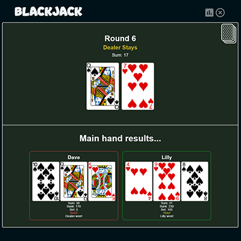
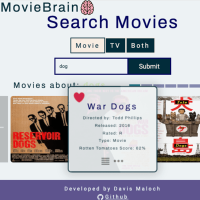

  

<h1>Hi 👋, I'm Davis</h1>

A passionate full-stack developer from Austin Texas

  I worked doing web dev at Florida Memory for 2 years, before moving to Austin
  Tx.

Currently working on a Software Engineering degree

Checkout some of the main Projects on my page!

<ul>
  <li>
    <a target="_blank" href="https://blackjack-react.netlify.app/">
      Multiplayer blackjack game with UI
    </a> 
    

        
    

    
  </li>
  <li>
    <a target="_blank" href="https://movie-brain.netlify.app/">
      Movie search app with user accounts and reviews -- built with MERN
    </a> 
    

        
    

  </li>
</ul>

<h2>🚀 Languages and Tools I Use</h2>

  
  
  
  
  
  
  
  
  
  
  
  
  
  
  
  

<h2>⚡️ Where to find me</h2>

  

<a
    target="_blank"
    href="https://davismaloch.netlify.app/"
    style="display: inline-block"
    >Portfolio site</a>

  

  

